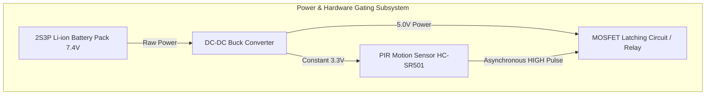

Advanced Architecture and Implementation of a Real-Time, LoRa-Enabled Anti-Poaching Camera Trap

## 1. Introduction and Architectural Paradigm Shift

   The protection of vulnerable wildlife in dense, remote forest environments requires technological interventions capable of operating reliably without human maintenance, cellular connectivity, or continuous power grids. Traditional camera traps utilize local storage to cache images, necessitating manual, physical retrieval by rangers. This latency renders them ineffective for real-time anti-poaching operations, transforming them into post-incident forensic tools rather than active preventative measures. Converseto ly, continuous live-video monitoring systems consume exorbitant amounts of energy, making them fundamentally unsuitable for battery-powered, long-term deployments in environments with dense canopies that severely limit solar recharging potential.
   To resolve this persistent dichotomy, the development of a real-time, event-driven anti-poaching camera trap is required. This system architecture dictates a workflow where the edge compute device remains in a zero-power or ultra-low-power offline standby state, awakened solely by a passive infrared (PIR) motion sensor. Upon waking, the device captures a static high-resolution photo—expressly avoiding the energy-intensive processing of live video streams—and executes an on-device convolutional neural network to detect the presence of humans[1].
   The workflow is highly deterministic: if the artificial intelligence model detects a human, representing a poaching threat, the device compresses the image and selectively transmits the visual evidence alongside telemetry data via a Long Range (LoRa) communication network to a centralized base station. If the object detected is non-human (such as passing wildlife or foliage moved by the wind), the system suppresses the radio transmission entirely, storing the image locally to the embedded SD card before immediately returning to an offline state to conserve finite battery reserves[1].
   This project builds upon foundational concepts such as the "WildLife AI" monitoring system[1], but introduces critical optimizations tailored for extreme energy scarcity. Notably, the system explicitly strips out global positioning hardware, such as the NEO-6M GPS module[1]. Because camera traps are deployed at fixed, pre-surveyed locations, the coordinates are static and known to the base station manager. Eliminating the GPS module removes the necessity for prolonged satellite acquisition times and eliminates its continuous power draw, dramatically enhancing the system's longevity. This report provides an exhaustive, engineering-level analysis of the hardware selection, operating system optimization, artificial intelligence pipeline, radio frequency protocol design, and power management strategies necessary to realize this autonomous anti-poaching network.
### 1.1 System Architecture and Circuit Mapping (Visual Overview)

   To visualize the workflow described above, the following diagram maps out the circuit connections, material components, and data logic of the entire offline camera trap system. It details the progression from the initial physical motion trigger to the final data transmission.

subgraph Edge Compute & Vision
        Latch -->|System Power On| RPi[Raspberry Pi Zero 2 W]
        RPi -->|GPIO Pin Hold HIGH| Latch
        Cam[Raspberry Pi NoIR Camera] -->|MIPI CSI-2| RPi
end

subgraph Artificial Intelligence Logic
        RPi -->|Execute INT8 Model| AI{YOLO Object Detection: Human Detected?}
        AI -- False Positive / Animal --> SD[Save High-Res Image to MicroSD]
        SD --> Halt[Pull GPIO LOW -> OS Shutdown]
        Halt -.->|Release Latch to 0W| B
end

subgraph RF Communication & Base Station
        AI -- True Positive / Human --> Compress[WebP Compression & Base64 Encode]
        Compress --> SPI[SPI Bus]
        SPI --> LoRa[SX1262 LoRa Transceiver]
        LoRa -->|Fragmented Transmission| Air((AS923 LoRa RF Link))
        Air --> Base[Seeed XIAO ESP32-C3 Base Station]
        Base -->|Wi-Fi / MQTT| Web[Conservation Cloud Dashboard]
        Base -.->|BLOCKNACK Retransmission| LoRa
end

## 2. Edge Compute Core Evaluation and Selection

   The processing core of the camera trap requires a delicate balance between computational throughput, which is necessary for executing complex object detection models, and extreme energy efficiency, which is vital for multi-month off-grid deployments. The architecture relies on an edge-to-gateway topology, consisting of the remote field node operating the camera and a distant base station managing the network reception.
### 2.1 The High-Performance Option: Raspberry Pi 5

   The foundational reference architecture for advanced wildlife monitoring often utilizes the Raspberry Pi 5 as the central processing unit[1]. The Raspberry Pi 5 features a Broadcom BCM2712 Cortex-A76 64-bit SoC running at 2.4GHz, delivering unprecedented performance for an embedded single-board computer[4]. This compute density allows for rapid execution of sophisticated AI models, minimizing the duration the system must remain in its active power state.
   However, deploying a high-performance computer in a deeply embedded, battery-operated scenario introduces severe power constraints. A fresh installation of the standard Raspberry Pi OS on the Pi 5 consumes between 2.7 Watts and 4 Watts of power merely at idle, a figure that is highly detrimental to battery life[5]. Furthermore, due to the specific Power Management Integrated Circuit (PMIC) design, the Pi 5 consumes over 1.2 Watts even when in a halted or shutdown state, actively draining the battery while ostensibly offline[7]. This occurs because the 5V rail remains active while the 3.3V rail shuts down, an architectural choice designed to maintain compatibility with specific Hardware Attached on Top (HAT) peripherals[7].
   To mitigate this parasitic draw on the Raspberry Pi 5, engineers must modify the system's EEPROM configuration. By executing the command to edit the bootloader configuration and explicitly setting the parameters POWER_OFF_ON_HALT=1 and WAKE_ON_GPIO=0, the PMIC is instructed to completely sever the power rails upon receiving a halt command[7]. This singular modification can reduce the standby power consumption from over 1.2 Watts down to approximately 0.01 Watts, representing an efficiency improvement of up to 140 times[11]. While these modifications drastically improve the Pi 5's viability, its active power consumption remains a significant engineering hurdle for solar-starved forest environments.
### 2.2 The High-Efficiency Option: Raspberry Pi Zero 2 W

   In direct contrast to the Pi 5, the Raspberry Pi Zero 2 W represents the optimized path for extreme energy conservation in motion-sensing applications[13]. The Zero 2 W features a quad-core ARM Cortex-A53 processor. While its raw clock speed is significantly lower than the Pi 5, it consumes a mere 0.5 to 0.8 Watts during active motion detection and inference[14].
   When properly configured with hardware power-gating, the deep sleep power draw of the Zero 2 W is virtually zero. Although inference times for object detection models are slower on the Zero 2 W, the bursty nature of a camera trap workload—where the system is entirely unpowered for days or weeks, activating only for a 3-second burst upon motion detection—makes the Zero 2 W objectively more efficient for deployments spanning multiple months or years[13]. The absence of complex memory controllers and PCIe subsystems on the Zero 2 W also contributes to a more deterministic interrupt latency, enabling highly precise motion timing that is sometimes degraded by the complex peripheral buses on higher-end boards[16].
| Compute Platform | SoC Architecture | Active Power Draw | Standby Power Draw (Optimized) | Optimal Use Case |
| :--- | :--- | :--- | :--- | :--- |
| Raspberry Pi 5 | BCM2712 Cortex-A76 (2.4GHz) | 3.7W - 5.0W+ | ~0.01W | Deployments requiring complex AI or where solar harvesting is abundant. |
| Raspberry Pi Zero 2 W | Cortex-A53 (1.0GHz) | 0.5W - 0.8W | <0.001W (Hardware Gated) | Deep forest deployments with minimal solar recharge potential. |

For this specific anti-poaching application, both platforms present viable solutions. If a massive 2S3P Lithium-ion battery pack (providing over 10,000mAh) and highly efficient solar panels are utilized, the Raspberry Pi 5 provides unparalleled inference speed[1]. However, the engineering consensus for deeply embedded, stealthy anti-poaching traps leans toward the Raspberry Pi Zero 2 W due to its inherently lower thermal signature and massive reduction in active power consumption, provided the chosen object detection model can be sufficiently quantized to run efficiently on the Cortex-A53 processor.

## 3. Power Gating and Asynchronous Wake-on-Interrupt Subsystems
Because the Raspberry Pi architecture fundamentally lacks the traditional sub-microampere "Suspend to RAM" sleep states found in microcontrollers, the system cannot rely on software-based sleep modes[17]. To achieve a true offline standby state, the system must employ an external hardware-based power gating mechanism that entirely severs the physical connection between the battery and the compute core.
### 3.1 Passive Infrared (PIR) Detection Mechanics

The primary sensory input for the system is a Passive Infrared (PIR) sensor, such as the ubiquitous HC-SR501[19]. This module operates continuously on a microampere power budget, utilizing dual pyroelectric sub-probes positioned behind a segmented Fresnel lens[16]. These probes detect the differential infrared radiation emitted by mammalian body heat. By measuring the delta between the two probes, the sensor effectively filters out ambient environmental temperature changes, triggering only when an infrared source moves across its field of view[20].
The PIR sensor requires an input voltage of 4.5V to 20V, perfectly matching a raw battery supply, and outputs a clean 3.3V TTL logic signal[20]. At idle, when no motion is detected, the digital output remains firmly pulled LOW. When a human poacher enters the detection zone, the output pulses HIGH, serving as the asynchronous hardware interrupt necessary to awaken the dormant camera trap[19].
### 3.2 Latching Circuitry and Boot Coordination

The 3.3V HIGH signal from the PIR sensor cannot power the Raspberry Pi directly; rather, it must drive an external latching circuit[11]. This is typically achieved using a Schmitt trigger combined with a P-channel MOSFET[12]. The Schmitt trigger provides hysteresis, ensuring that fluctuating or noisy signals from the PIR sensor do not cause rapid, unstable power cycling, while the MOSFET acts as the high-current physical switch between the battery and the Raspberry Pi's 5V rail[22].
Alternatively, integrated power management boards equipped with Real-Time Clocks (RTC), such as the Witty Pi, can serve this function[23]. These boards allow the system to be awakened by external triggers or by predefined epoch-time alarms programmed into the RTC's registers[24].
The wake sequence must be meticulously orchestrated to ensure system stability. When the PIR sensor detects thermal movement, it asserts its output HIGH, engaging the MOSFET latch and flooding the Raspberry Pi with power[18]. The Raspberry Pi initiates its boot sequence. Because the PIR sensor's HIGH pulse is temporary—often lasting only a few seconds depending on the onboard potentiometer settings—the Raspberry Pi must immediately assert a dedicated GPIO pin HIGH upon booting[27]. This GPIO pin connects back to the latching circuit, artificially "holding" the power gate open even after the PIR sensor's signal drops back to LOW[27].
Once the compute core has captured the image, processed the AI inference, and transmitted the data via LoRa, the final step in the software script is to pull the "hold" GPIO pin LOW. The operating system then safely executes a sudo halt or poweroff command. As the system goes dark, the physical latch releases, completely cutting power to the board and returning the entire camera trap to a 0 Watt offline state, awaiting the next physical intrusion[10].

## 4. Vision Subsystem and Optical Configuration
The vision subsystem is responsible for capturing the visual evidence that the AI model will analyze. The hardware selected for this task must operate effectively across highly variable lighting conditions without generating excessive power draw.
The architecture utilizes the Raspberry Pi Camera Module 3 NoIR (No Infrared filter) variant, equipped with a wide-angle lens[1]. The absence of an IR filter is absolutely essential for deep forest environments, where the dense biological canopy drastically reduces ambient photon availability, creating twilight conditions even during daylight hours.
In traditional commercial camera traps, nighttime imaging is achieved by flooding the environment with high-intensity active Infrared LEDs. While effective, this approach introduces severe energy spikes that can cause voltage sag and trigger brownouts in battery-operated systems[1]. To circumvent this, the camera trap limits active IR illumination entirely. Instead, the camera relies on the ambient near-infrared light provided by moonlight and starlight. If absolutely necessary for completely pitch-black environments, a highly localized, low-power IR LED flash is synchronized precisely with the camera shutter, active only for the millisecond duration of the exposure[28].
The system utilizes the command-line image capture utility libcamera-jpeg or raspistill, bypassing complex graphical interfaces or RTSP streaming protocols. By invoking hardware-accelerated JPEG compression directly at the ISP (Image Signal Processor) level, the system minimizes frame-to-disk latency, achieving acquisition speeds under 100 milliseconds post-boot[13]. This rapid acquisition is vital to ensure the poacher, who may be moving swiftly through the frame, is captured before exiting the sensor's field of view.

## 5. Operating System Minimization and Fast-Boot Dynamics
A critical vulnerability in any trigger-based, offline camera trap is the latency between the physical intrusion and the camera's shutter activation. A standard, unmodified installation of Raspberry Pi OS requires between 20 and 45 seconds to boot the kernel, initialize user-space services, and launch high-level applications[30]. In a dense forest environment, a poacher walking at a moderate pace will completely traverse the camera's field of view within this standard boot window, resulting in empty photographs[27].
To overcome this, the operating system must be aggressively stripped down to achieve a sub-5-second boot-to-capture latency, making the system functionally indistinguishable from an always-on device[30].
### 5.1 Custom Kernel Compilation via Buildroot

The optimal solution for achieving ultra-fast boot times is utilizing Buildroot to compile a highly customized, minimal Linux image tailored specifically for the exact hardware topology of the camera trap[32]. Buildroot allows engineers to bypass the bloat of traditional Debian-based distributions, generating a root filesystem that contains only the absolute minimum binaries required for operation[33].
Through Buildroot, the Linux kernel is recompiled to exclude all unnecessary drivers. Because the field device operates entirely offline and communicates exclusively via the SPI-connected LoRa module, the entire networking stack can be safely excised. TCP/IP, Wi-Fi drivers (brcmfmac), Bluetooth daemons, NetworkManager, and DHCP clients are completely removed from the kernel[30]. Similarly, USB support and HDMI framebuffer initialization are disabled, which not only saves precious seconds during hardware probing but also permanently reduces the baseline power consumption by approximately 20-30mA[34].
### 5.2 Bypassing Systemd and Utilizing Initramfs

Modern Linux distributions rely on systemd to manage the initialization of services. However, the dependency resolution and parallel startup sequences of systemd introduce unacceptable delays for a device whose sole purpose is to execute a single Python or C++ script[36].
In the optimized architecture, the init system is either replaced entirely by a simple BusyBox sysvinit script or bypassed altogether[34]. The most extreme optimization involves packaging the target object detection and camera control application directly into the Initial RAM Disk (initramfs).
In this configuration, the boot sequence operates as a highly streamlined cascade:
0.0s – 2.0s: The hardware receives power from the PIR latch; the proprietary GPU Bootloader initializes the silicon and loads the minimal Linux kernel[36].
2.0s – 3.5s: The kernel decompresses and mounts the initramfs directly into RAM. Instead of spawning an init daemon, the kernel executes the camera and AI application as the primary process (PID 1)[34].
3.5s – 4.0s: The application initializes the MIPI CSI-2 camera interface, acquires the image, and locks the power-holding GPIO pin[31].
This methodology obliterates the standard OS overhead, reducing the total time from the subject triggering the sensor to the acquisition of the photographic evidence to under 4 seconds[38]. This deterministic speed guarantees that the poaching suspect remains squarely within the frame.

## 6. Embedded Artificial Intelligence and Edge Inference
Once the high-resolution image is acquired, the system must perform on-device inference to determine the nature of the intrusion. This differentiation is the crux of the system's efficiency paradigm. Transmitting false positives—such as falling branches, passing deer, or shifting shadows—over a severely bandwidth-constrained LoRa link wastes massive amounts of transmission time and battery life.
### 6.1 Architectural Model Selection: YOLOv8n vs. YOLOv5n

The YOLO (You Only Look Once) family of convolutional neural networks provides an optimal trade-off between mean Average Precision (mAP) and inference latency on resource-constrained edge devices[40]. Because the system relies solely on the CPU (avoiding the power draw of dedicated Neural Processing Units or GPUs), the "Nano" variants of the architecture are mandatory[41].
YOLOv8 introduces several architectural advancements over its predecessors, specifically the implementation of an anchor-free estimation mechanism. This accelerates post-processing by streamlining the Non-Maximum Suppression (NMS) algorithm used to calculate overlapping bounding boxes[42]. Furthermore, the YOLOv8 architecture utilizes a CSPDarknet backbone that effectively splits feature maps and incorporates the Sigmoid Linear Unit (SiLU) activation function, enhancing gradient flow and feature reuse[18]. With approximately 3.2 million parameters, the YOLOv8n model can achieve a high detection accuracy (Average Precision > 0.85) while maintaining an exceedingly small memory footprint[18].
Alternatively, the older YOLOv5n model remains highly relevant for the Cortex-A53 cores found on the Raspberry Pi Zero 2 W, offering a highly mature deployment pipeline with exceptional stability[15].
| Model Variant | Parameter Count | Key Architectural Advantage | Optimal Hardware Target |
| :--- | :--- | :--- | :--- |
| YOLOv8n | ~3.2 Million | Anchor-free NMS, CSPDarknet Backbone | Raspberry Pi 5 |
| YOLOv5n | ~1.9 Million | Mature quantization support, minimal RAM overhead | Raspberry Pi Zero 2 W |

### 6.2 Post-Training Quantization (PTQ)

To execute these neural networks on a CPU with limited RAM and thermal constraints, the model weights must undergo extreme optimization. The standard models are trained using Floating-Point 32-bit (FP32) weights, which are computationally expensive to process[15]. The architecture mandates the use of Post-Training Full Integer Quantization (PTQ), converting the FP32 weights into 8-bit Integers (INT8)[18].
Quantizing the model serves two critical functions vital for embedded systems:
Memory Bandwidth Alleviation: The conversion to INT8 compresses the physical size of the model by approximately 74.6%[15]. For instance, a YOLOv5n model is reduced to roughly 2.6 MB in size[43]. This allows the entire model to fit within the fast L2 cache of the CPU, avoiding the massive latency penalties associated with fetching data from the main system RAM[14].
Arithmetic Acceleration: It replaces complex, multi-cycle floating-point mathematics with highly efficient Single Instruction, Multiple Data (SIMD) integer arithmetic, allowing the ARM cores to process multiple weights simultaneously[15].
By deploying the INT8 quantized model via the TensorFlow Lite (TFLite) or ONNX Runtime execution engines, inference times can be drastically reduced. On a Raspberry Pi 5, processing a 640x640 pixel frame requires only 10 to 35 milliseconds[4]. Even on the lower-power Pi Zero 2 W, inference is completed in under 250 milliseconds, ensuring the decision logic executes almost instantaneously after the photo is acquired[15].
### 6.3 Decision Logic and Storage Routing

The inference pipeline analyzes the bounding box predictions generated by the model. If the confidence score for the "Person" class exceeds a strict predefined threshold (e.g., 0.70), the event is classified as a True Positive. The system immediately shifts into its transmission state, staging the image and associated metadata (timestamp, battery voltage, hardware node ID) for LoRa transfer[1].
If the model detects only animals, or if the confidence score falls below the threshold, the event is classified as a True Negative. The system suppresses the energy-intensive LoRa transmission phase entirely. The high-resolution image is saved silently to the local MicroSD card for future ecological study by biologists, and the system immediately halts, releasing the power latch to conserve energy[1].

## 7. Image Processing and Extreme Data Minimization
Transmitting an image over a LoRa network represents an extreme edge case in IoT communications engineering. The LoRa physical layer was explicitly designed for small, sporadic payloads—such as temperature or humidity telemetry ranging from 10 to 50 bytes—not for multi-kilobyte multimedia files[20]. A standard JPEG image generated by a 5-megapixel camera can easily exceed 2.5 Megabytes. Attempting to transmit this over a 35 kbps LoRa link is both mathematically and practically impossible within regulatory duty-cycle limits[46]. Therefore, aggressive pre-transmission data minimization is mandatory.
### 7.1 Resolution Scaling and Color Space Reduction

Prior to transmission, the captured image must be severely downscaled. While high-resolution images are saved locally, the transmitted file serves merely as an alert mechanism. A resolution of 160x120 pixels or 128x128 pixels is computationally sufficient for a human operator at the base station to verify the presence of a poacher[13].
Simultaneously, the image is converted from the RGB color space to grayscale. By eliminating the chrominance channels entirely, the raw pixel data volume is immediately reduced by 66.6%. This preserves only the luminance data, which is entirely adequate for shape, silhouette, and edge identification[50].
### 7.2 Algorithmic Compression: WebP and Base64 Encoding

While JPEG is the ubiquitous standard for photographic compression, its reliance on an 8x8 block Discrete Cosine Transform (DCT) introduces severe, unrecognizable artifacts when pushed to very low bitrates on small image sizes[51]. To combat this, the system implements WebP compression[48].
WebP utilizes predictive intra-frame coding, a technique adopted from the VP8 video codec, which allows it to compress small, low-resolution grayscale images significantly more efficiently than JPEG while maintaining sharper edge definitions[29]. By applying aggressive WebP lossy compression to a 128x128 grayscale matrix, the final file size can be reliably reduced to a footprint ranging between 1.5 KB and 3.0 KB[36].
For seamless transmission over serial and RF interfaces, this binary image data is subsequently encoded into Base64 format. While Base64 encoding increases the total payload size by approximately 33%, it allows the image data to be packaged cleanly alongside ASCII-based JSON metadata, simplifying the parsing logic at the receiving base station[36].

## 8. LoRa Radio Frequency Communication Protocol
The physical layer constraints of Chirp Spread Spectrum (CSS) modulation define the absolute limits of the communication network. The Time-on-Air (ToA) of any given LoRa packet is governed by three primary parameters: the Spreading Factor (SF), the Bandwidth (BW), and the Coding Rate (CR)[48]. Higher spreading factors (such as SF10 or SF12) dramatically increase receiver sensitivity and expand the geographical range, allowing the signal to penetrate dense trunks and foliage, but they simultaneously increase the transmission time exponentially[48].
The architecture utilizes the Semtech SX1262 LoRa transceiver module in place of older generations like the SX1278. The SX1262 provides superior power efficiency, drawing a mere 5.3mA in receive mode, and can output up to +22dBm of transmit power to punch through physical environmental barriers[53].
### 8.1 Custom Fragmented MAC Layer

Standard LoRaWAN networking protocols are ill-equipped for transferring a 3 KB file because they do not natively handle heavy packet fragmentation, sequencing, and reassembly without introducing substantial overhead and complexity[1]. Therefore, the system bypasses LoRaWAN entirely, utilizing a custom Point-to-Point (P2P) Medium Access Control (MAC) layer implemented in Python[53].
The transmission protocol is orchestrated through a highly structured workflow:
Signaling and Handshake: The camera trap initiates the sequence by transmitting a configuration packet containing a distinct header, such as #IMAGE# <ImageSize_in_Bytes> <Total_Chunks>[52]. This alerts the base station to allocate the necessary memory buffers.
Payload Fragmentation: The 3 KB Base64 encoded WebP image is mathematically chunked into discrete payloads. Each payload is sized strictly under 200 bytes to comfortably adhere to the 255-byte absolute physical layer limit of the SX1262 transceiver[20].
Encapsulation: Each individual fragment is prefixed with a 4-byte application header comprising a Transaction ID, Sequence Number, Source Node ID, and Destination ID[52].
Interleaved Burst Transmission: The camera trap transmits the fragments sequentially. To mitigate the "bursty" interference characteristics caused by wind moving dense foliage, the system can utilize an interleaved packet splitting technique. By distributing spatially adjacent pixel data across different, non-sequential packets, the loss of a single packet results in scattered missing pixels rather than a massive horizontal blackout across the reconstructed image. This ensures the base station operator can still visually parse the image even under high packet loss conditions[29].
BLOCKNACK and Selective Retransmission: Once the transmission burst concludes, the receiving base station evaluates the array of received sequence numbers. It then transmits a Negative Acknowledgment (BLOCKNACK) packet back to the camera trap, containing an array of any missing sequence IDs. The camera trap selectively retransmits only those dropped packets until a complete file reconstruction is mathematically confirmed by the base station[53].

## 9. Regulatory Compliance and Spectrum Utilization
For deployments operating in international contexts, such as those utilizing the AS923 frequency band common in Southeast Asia (e.g., Thailand), strict adherence to regional telecommunications regulations is legally mandated and technically required to prevent network saturation.
In Thailand, the National Broadcasting and Telecommunications Commission (NBTC) governs the spectrum via the TS 1033-2560 standard for non-RFID systems[60]. The AS923 frequency band operates between 920 MHz and 925 MHz[61].
The regulations present specific allowances and limitations that define the network's boundaries:
Maximum Transmit Power: Systems operating in this band are permitted to transmit up to 4 Watts Effective Isotropic Radiated Power (EIRP), which equates to 36 dBm[61]. This exceptionally high legal limit is a massive advantage for deep-forest deployments. It allows the SX1262 transceiver to be operated at its absolute maximum +22 dBm output, which can be paired with high-gain directional antennas (such as Yagi-Uda designs) to achieve reliable transmission distances exceeding 5 kilometers through dense biological matter[1].
Duty Cycle Limitations: The spectrum access rules mandate a strict maximum 10% duty cycle within any 1-hour rolling period[30].
This duty cycle directly dictates the system's theoretical maximum event rate. Transmitting a 3 KB image, fragmented into 200-byte chunks utilizing a Spreading Factor of 9 (SF9) and a Bandwidth of 125kHz, requires approximately 15 to 30 seconds of total Time-on-Air. A 10% duty cycle affords a device exactly 360 seconds of transmission time per hour. Consequently, the camera trap can legally and technically transmit up to 12 human-detection events per hour[48]. In a realistic anti-poaching scenario, this capacity is more than sufficient, as human intrusions in deep restricted zones are exceedingly rare but highly critical anomalies.
| Regulatory Parameter (NBTC TS 1033-2560) | Specification | System Impact |
| :--- | :--- | :--- |
| Frequency Band | 920 MHz - 925 MHz | Utilizes standard AS923 LoRa transceiver configurations. |
| Maximum Output Power | 4 Watt EIRP (36 dBm) | Allows for maximum module output (+22dBm) and high-gain directional antennas. |
| Spectrum Access | 10% Duty Cycle per Hour | Limits transmission to ~360 seconds/hour (~12 image transmissions). |

## 10. Base Station Architecture and Cloud Integration

The receiving base station acts as the critical bridge, translating the fragmented, low-bandwidth, long-range RF signals into standard IP networking protocols accessible by conservation managers globally.
### 10.1 Gateway Hardware

The base station utilizes a highly efficient microcontroller equipped with integrated Wi-Fi capabilities, such as the Seeed Studio XIAO ESP32-C3, paired physically with a matching SX1262 LoRa module via SPI[1]. Unlike the remote camera traps, the base station is positioned at a ranger outpost or a facility with continuous solar or grid power, allowing it to remain in a persistent listening state, waiting for the initial #IMAGE# configuration packet[53].
Upon receiving a burst of packets, the ESP32-C3 executes the custom MAC logic: extracting the payload strings, reassembling the Base64 bytes based on sequence numbers, and verifying the integrity against the expected file size[1].
### 10.2 Telemetry Routing and Geographic Mapping

Once the image is successfully reconstructed, the ESP32-C3 utilizes its integrated Wi-Fi antenna to relay the image string and associated telemetry via lightweight MQTT protocols or HTTPS POST requests to a secure central server[1].
A web dashboard, developed using modern frameworks like Next.js, serves as the command-and-control interface for the ranger teams[1]. The dashboard parses the incoming JSON telemetry. Crucially, because the camera traps are deployed at fixed, known locations, the base station server simply cross-references the hardware Node ID of the incoming transmission against a static database of latitude and longitude coordinates.
This architectural choice effectively virtualizes the GPS functionality. It provides the rangers with real-time geographic mapping of the poaching event without forcing the edge device to expend massive amounts of energy powering a dedicated GPS silicon module[1]. The dashboard displays the reconstructed image alongside the pinpointed location on a topological map, granting rangers instant, visual confirmation of the threat and allowing for immediate, targeted interception.
## 11. Power Autonomy and Environmental Resilience

The ultimate success of a "deploy and forget" camera trap hinges not only on its computing efficiency but on its physical energy autonomy and its ability to withstand harsh, degrading microclimates.
### 11.1 Battery Sizing and Voltage Regulation

The primary power reservoir for the remote edge device is a Lithium-Ion battery pack configured in a 2S3P arrangement (two cells in series, three cells in parallel)[1].
Voltage Stability: The 2S configuration yields a nominal voltage of 7.4V. This is highly advantageous because it provides substantial overhead for a high-efficiency Buck Converter (DC-DC step-down module) to regulate a perfectly stable, noise-free 5.0V supply for the Raspberry Pi and the 3.3V rail for the PIR sensor and LoRa module[1].
Capacity Expansion: The 3P configuration multiplies the total capacity, easily achieving 9,000 to 10,000 mAh depending on the cell chemistry used[1].
Given the deep sleep hardware-gating optimizations (drawing <1mA in standby), the primary power drain is isolated to the active state[13]. A complete execution cycle—waking up, capturing an image, inferencing the AI model, transmitting via LoRa, and halting—requires approximately 15 seconds. If the device uses 2.5 Watts during this active phase, the total Watt-hours consumed per event is infinitesimally small. A fully charged 10,000 mAh battery could theoretically sustain thousands of detection and transmission events before depletion, offering multi-year standby autonomy.
### 11.2 Solar Harvesting in Dense Canopies

While solar panels theoretically provide infinite operational autonomy, deploying them on the forest floor presents a highly complex photovoltaic challenge. The shading effect of massive old-growth trees relies heavily on the morphological parameters of the canopy, significantly reducing the Sky View Factor (SVF) and the total global horizontal irradiance reaching the device[65].
The solar altitude angle and the azimuth angle of the sun interact continuously with the dense canopy structure to block direct solar radiation for the majority of the day[66]. In deep forest environments, diffuse solar irradiance—light scattered by the atmosphere and refracted through leaves—becomes the primary source of energy[9].
Therefore, the system cannot rely on standard cheap polycrystalline panels. It must employ amorphous silicon or highly sensitive monocrystalline solar panels explicitly optimized for low-light, diffuse conditions. These panels must be coupled with an advanced Maximum Power Point Tracking (MPPT) charge controller. The MPPT algorithm dynamically adjusts the electrical load resistance to extract the maximum available wattage from the heavily shaded panels, trickling this charge into the 2S3P battery pack to offset the passive drain and replenish the energy spent during sporadic active bursts[68].
### 11.3 Enclosure Engineering and Thermal Management

The internal hardware must be housed in a ruggedized, weatherproof enclosure capable of surviving extreme humidity, heavy rainfall, and physical impacts. Standard ABS plastic is insufficient for long-term deployment due to severe thermal retention issues and rapid UV degradation[1].
A passive aluminum enclosure, or a high-density polycarbonate blend featuring an internal matte-black coating, is required. The matte-black interior serves a crucial optical function: it reduces internal infrared reflection by up to 92%, preventing stray IR light from blinding the camera sensor[16]. Moisture and condensation are catastrophic to the exposed pins of the Raspberry Pi and the SX1262 SPI bus. The enclosure must achieve a strict IP67 ingress protection rating, utilizing custom silicone rubber gaskets and internal silica gel desiccant packs to actively absorb internal humidity[69]. Finally, the external camera window requires a specialized hydrophobic coating to prevent water droplets and biological detritus from accumulating and obstructing the AI model's field of view.
## 12. Conclusion

The architecture and deployment of a real-time, anti-poaching camera trap demand a radical paradigm shift away from traditional, always-on IoT computing methodologies. By implementing a strictly event-driven hardware topology—where the entire system remains in a physically disconnected, zero-power state until awakened by a pyroelectric thermal differential—the severe energy limitations of edge computing in deep forests are successfully circumvented.
The integration of a customized, heavily stripped Linux kernel via Buildroot enables the underlying Raspberry Pi to transition from an unpowered state to capturing forensic photographic evidence in under 4 seconds, ensuring the target is acquired. The deployment of an INT8-quantized YOLO object detection model guarantees that the computational overhead is minimized to fit within limited memory bandwidths. Crucially, this embedded AI ensures that vital battery life and LoRa spectrum bandwidth are only expended when human threats are positively identified, silently filtering out the noise of the natural environment.
Furthermore, the novel application of WebP image compression combined with a custom, fragmented MAC layer operating over the heavily regulated AS923 LoRa spectrum enables the transmission of critical visual evidence across vast expanses of trackless forest, entirely independent of cellular networks.
This rigorous synthesis of deep embedded systems engineering, artificial intelligence, and long-range radio frequency physics produces a highly scalable, autonomous tool. It removes the latency inherent in physical SD card retrieval and provides conservation managers with immediate, actionable intelligence. By virtualizing location data and optimizing every milliwatt of power, this system serves as a highly effective, invisible vanguard for global wildlife protection efforts.
## Works Cited

1. [WildLife AI - Hackster.io](https://www.hackster.io/gavindu911/wildlife-ai-f8e87b)
2. [ESP32-CAM PIR Motion Detector with Photo Capture - Random Nerd Tutorials](https://randomnerdtutorials.com/esp32-cam-pir-motion-detector-photo-capture/)
3. [Fauna-Flash - Hackster.io](https://www.hackster.io/pasu_labs/fauna-flash-cb83e7)
4. [YOLO26 on Raspberry Pi: Setup & Benchmarks | Ultralytics Docs](https://docs.ultralytics.com/guides/raspberry-pi)
5. [Reduce power consumption of Pi 5 - Raspberry Pi Forums](https://forums.raspberrypi.com/viewtopic.php?t=384340)
6. [Pi 5 power consumption - Raspberry Pi - Pimoroni Buccaneers](https://forums.pimoroni.com/t/pi-5-power-consumption/23959)
7. [Reducing Raspberry Pi 5's power consumption by 140x - Jeff Geerling](https://www.jeffgeerling.com/blog/2023/reducing-raspberry-pi-5s-power-consumption-140x/)
8. [How To Reduce Raspberry Pi 5, 4 Standby Power Consumption | Tom's Hardware](https://www.tomshardware.com/raspberry-pi/how-to-reduce-raspberry-pi-5-4-standby-power-consumption)
9. [Raspi 5 power usage while beeing switched off](https://raspberrypi.stackexchange.com/questions/149182/raspi-5-power-usage-while-beeing-switched-off)
10. [[SOLVED] EEPROM settings documentation - Raspberry Pi Forums](https://forums.raspberrypi.com/viewtopic.php?t=365557)
11. [How can I sleep a raspberry pi and wake it again with an interrupt? | Little Bird Electronics](https://littlebirdelectronics.com.au/blogs/news/how-can-i-sleep-a-raspberry-pi-and-wake-it-again-with-an-interrupt)
12. [Raspberry Pi PIR motion sensor with Schmitt Trigger](https://forums.raspberrypi.com/viewtopic.php?t=71393)
13. [The Raspberry Pi Zero Makes a Great Motion-Sensing Security Camera - LifeTips](https://lifetips.alibaba.com/tech-efficiency/the-raspberry-pi-zero-makes-a-great-motion-sensing-secu)
14. [Arduino Interrupts with PIR Motion Sensor - Maker Portal](https://makersportal.com/blog/2019/5/27/arduino-interrupts-with-pir-motion-detector)
15. [Real-Time Object Detection Using Raspberry Pi Zero 2W: An Optimized Approach](https://www.researchgate.net/publication/399120906_Real-Time_Object_Detection_Using_Raspberry_Pi_Zero_2W_An_Optimized_Approach)
16. [MAXIIOT DL7612-AS923-TH - lorawan : Inspired by LnwShop.com (v2)](http://lorawan.lnwshop.com/product/113/maxiiot-dl7612-as923-th)
17. [Is there a Raspberry Pi - class computer with suspend to ram? : r/raspberry_pi - Reddit](https://www.reddit.com/r/raspberry_pi/comments/6zifib/is_there_a_raspberry_pi_class_computer_with/)
18. [wake up raspberry pi zero W with motion detection : r/raspberry_pi - Reddit](https://www.reddit.com/r/raspberry_pi/comments/60cr5l/wake_up_raspberry_pi_zero_w_with_motion_detection/)
19. [PIR Sensor Interfacing With Raspberry Pi : 5 Steps - Instructables](https://www.instructables.com/PIR-Sensor-Interfacing-With-Raspberry-Pi/)
20. [Multimedia Transmission over LoRa Networks for IoT Applications: A Survey of Strategies, Deployments, and Open Challenges - MDPI](https://www.mdpi.com/1424-8220/25/23/7128)
21. [Raspberry Pi GPIO Sensing: Motion Detection - The Pi Hut](https://thepihut.com/blogs/raspberry-pi-tutorials/raspberry-pi-gpio-sensing-motion-detection)
22. [LoRa / LoRa+WiFi - Arduino, Raspberry Pi, NodeMCU, IoT, Nvidia, Lora, AI, Machine Learning, Teensy, Lidar - Arduitronics](https://www.arduitronics.com/category/182/internet-of-things-iot/lora-lorawifi)
23. [Troubleshooting Witty Pi Clock - Raspberry Pi Forums](https://forums.raspberrypi.com/viewtopic.php?t=279880)
24. [Witty Pi: Realtime Clock + Power Management for Raspberry Pi - UUGear](https://www.uugear.com/witty-pi-realtime-clock-power-management-for-raspberry-pi/)
25. [Auto-Wake a Pi5 without a Pijuice! - General - GOSH Community Forum](https://forum.openhardware.science/t/auto-wake-a-pi5-without-a-pijuice/5967)
26. [Dragino LoRaWan Gateway LG308-AS923-TH-EC25 - Arduitronics](https://www.arduitronics.com/product/5066/dragino-lorawan-gateway-lg308-as923-th-ec25)
27. [Image Transmission via LoRa Networks – A Survey - Semantic Scholar](https://www.semanticscholar.org/paper/Image-Transmission-via-LoRa-Networks-%E2%80%93-A-Survey-Staikopoulos-Kanakaris/9b5d17ad9e3f21e76f4c4ad3b54cfa3683a666c2)
28. [Project | Camera Traps for Citizen Science - Hackaday.io](https://hackaday.io/project/11088/logs)
29. [How I deployed a real-time object detection model on a Raspberry Pi | by Dixit Mudakavi](https://medium.com/@dixitmudakavi04/how-i-deployed-a-real-time-object-detection-model-on-a-raspberry-pi-b392c9789be2)
30. [Raspberry Pi Boot Time Optimization: Complete Performance Guide](https://ohyaan.github.io/tips/raspberry_pi_boot_time_optimization__complete_performance_guide/)
31. [Ultra fast boot Raspberry Pi 3 (Under 4 sec to camera/prompt, full Raspbian) - Reddit](https://www.reddit.com/r/raspberry_pi/comments/96q24h/ultra_fast_boot_raspberry_pi_3_under_4_sec_to/)
32. [Custom Minimal Linux on Raspberry Pi - Hackster.io](https://www.hackster.io/shubhamsantosh99/custom-minimal-linux-on-raspberry-pi-cc7fdb)
33. [Buildroot for a more reliable Pi - Jack Whitham](https://www.jwhitham.org/2025/07/buildroot-for-more-reliable-pi.html)
34. [Raspberry Pi 3 Fastboot – Less Than 2 Seconds | Hacker News](https://news.ycombinator.com/item?id=28969386)
35. [Power Saving on Raspberry Pi OS: Complete Optimization Guide](https://ohyaan.github.io/tips/power_saving_on_raspberry_pi_os__complete_optimization_guide/)
36. [Image Transmission over LoRa-Based Networks: A Performance Study Using Image Compression and Reconstruction Methods - ResearchGate](https://www.researchgate.net/publication/379057637_Image_Transmission_over_LoRa-Based_Networks_A_Performance_Study_Using_Image_Compression_and_Reconstruction_Methods)
37. [RPI5 EEPROM Modification „PSU_MAX_CURRENT=5000“ Anabling the use with a non-USB-PD Bench-Power Supply - DDDAC](http://blog.dddac.com/wp-content/uploads/Flash-RPi5-and-adding-5000mA-Line-tutorial.pdf)
38. [Raspberry Pi 5 EEPROM Recovery Guide - Pi Australia](https://piaustralia.com.au/pages/raspberry-pi-5-eeprom-recovery-guide)
39. [usbboot/docs/secure-boot.md at master - GitHub](https://github.com/raspberrypi/usbboot/blob/master/docs/secure-boot.md)
40. [A Comprehensive Evaluation of Deep Learning Object Detection Models on Heterogeneous Edge Devices - arXiv](https://arxiv.org/pdf/2409.16808)
41. [Real-Time Object Detection with QuantizedYOLOv11 and YOLOv8 on Raspberry Pi 5 for Low-Speed ADAS - ResearchGate](https://www.researchgate.net/publication/399780145_Real-Time_Object_Detection_with_QuantizedYOLOv11_and_YOLOv8_on_Raspberry_Pi_5_for_Low-Speed_ADAS)
42. [A Comprehensive Evaluation of YOLO-Based Deer Detection Performance on Edge Devices - MDPI](https://www.mdpi.com/2079-9292/15/5/1026)
43. [Implementation of visual people counting algorithms in embedded systems - ResearchGate](https://www.researchgate.net/publication/394131540_Implementation_of_visual_people_counting_algorithms_in_embedded_systems)
44. [Raspberry pi5 and power on from gpio 3](https://forums.raspberrypi.com/viewtopic.php?t=370675)
45. [Comparative Benchmarking of CPU, GPU, and NPU Architectures for Real-Time YOLOv8n Inference on Embedded Edge Platforms - ResearchGate](https://www.researchgate.net/publication/401704444_Comparative_Benchmarking_of_CPU_GPU_and_NPU_Architectures_for_Real-Time_YOLOv8n_Inference_on_Embedded_Edge_Platforms)
46. [Raspberry Pi AI/ML Projects: TensorFlow Lite on Pi 5 - Zbotic](https://zbotic.in/raspberry-pi-ai-ml-projects-tensorflow-lite-on-pi-5/)
47. [Gavindu Achintha's Projects - Hackster.io](https://www.hackster.io/gavindu911/projects)
48. [Multimedia Transmission over LoRa Networks for IoT Applications: A Survey of Strategies, Deployments, and Open Challenges - Preprints.org](https://www.preprints.org/manuscript/202510.1775)
49. [Best Lightweight Tracker for Real-Time Use on Raspberry Pi 5 : r/computervision - Reddit](https://www.reddit.com/r/computervision/comments/1jy9sw7/best_lightweight_tracker_for_realtime_use_on/)
50. [Reconstruction of Images Transmitted over LoRa Networks Using Fully Convolutional Neural Network - ISD 2025](https://isd2025.fon.bg.ac.rs/wp-content/uploads/ISD_2025_camera_ready_207.pdf)
51. [Image compression for webcomics - Stack Overflow](https://stackoverflow.com/questions/422902/image-compression-for-webcomics)
52. [Transmission of Images over LoRa - Zenodo](https://zenodo.org/records/15727186/files/050-Navarro.pdf?download=1)
53. [Pico-LoRa-SX1262](https://m.media-amazon.com/images/I/B1xoFMTZAeL.pdf)
54. [Pico-LoRa-SX1262 - Waveshare Wiki](https://www.waveshare.com/wiki/Pico-LoRa-SX1262)
55. [LoRa SX1262 Raspberry Pi Connection Guide | PDF | Codec - Scribd](https://www.scribd.com/document/972830561/LoRa1)
56. [chandrawi/LoRaRF-Python: Python library for basic transmitting and receiving data using LoRa and FSK modem - GitHub](https://github.com/chandrawi/LoRaRF-Python)
57. [Secure LoRa-Based Transmission System: An IoT Solution for Smart Homes and Industries](https://www.mdpi.com/2079-9292/14/24/4977)
58. [Loss-Resilient Thermal Image Fragmentation for LoRa Mesh IoT Networks - Pomiary Automatyka Robotyka](https://www.par.pl/content/download/19911/291837/file/LossResilientThermalImageFragmentationLoRaMeshIoTNetworks.pdf)
59. [SX1262 915M LoRa HAT - Waveshare Wiki](https://www.waveshare.com/wiki/SX1262_915M_LoRa_HAT)
60. [TH AS923 e iC MOD - EmOne](https://www.emone.co.th/wp-content/uploads/2018/05/iCAS923TH_Datasheet_V0_1_1_draft_compact.pdf)
61. [Thailand Updates NBTC Rules for RFID and Non-RFID - 360 Compliance](https://360compliance.co/global-market-access/thailand-nbtc-updates-920-925mhz-usage-rfid-non-rfid/)
62. [[Feature Request]: Adjust Thailand (TH) LoRa radio configuration for Meshtastic · Issue #8482 - GitHub](https://github.com/meshtastic/firmware/issues/8482)
63. [Wirnet iBTS - FCC Report](https://fcc.report/FCC-ID/2AFYS-KLK64HIGHWAY/4308962.pdf)
64. [Raspberry Pi 5 robotics ideas - Scouts by Yutori](https://scouts.yutori.com/e3d5adba-2867-4555-b685-0b727a694121)
65. [A panorama-based technique to estimate sky view factor and solar irradiance considering transmittance of tree canopies - Urban Analytics Lab](https://ual.sg/publication/2024-bae-svf/2024-bae-svf.pdf)
66. [Trees, Sunlight, and Solar Panels: Finding the Right Balance Optimizing Generation from a Solar Array by Minimizing Shade Loss | American Solar Energy Society](https://ases.org/trees-sunlight-and-aolar-panels-finding-the-right-balance-optimizing-generation-from-a-solar-array-by-minimizing-shade-loss/)
67. [Calculation of the Shading Factors for Solar Modules with MATLAB - MDPI](https://www.mdpi.com/1996-1073/14/15/4713)
68. [Assessment of technological developments for camera‐traps: a wireless transmission system and solar panels - Universidade de Lisboa](https://repositorio.ulisboa.pt/bitstreams/661ded85-9707-4d74-8b73-5d66229aed0d/download)
69. [E-DMK-Quick-start-guide-Wirnet_iStation_v5.0_06112020.indd PDF document](https://device.report/m/75dc68ca81f156a89138c624a15e842aa756e683aa3fdbe1891e0494da3b5975)
